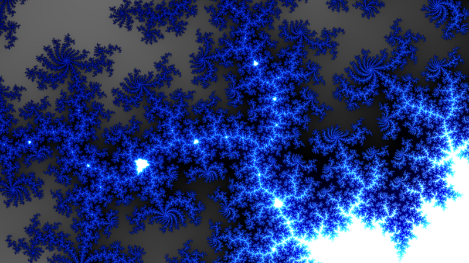
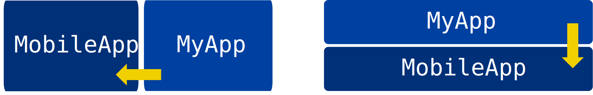
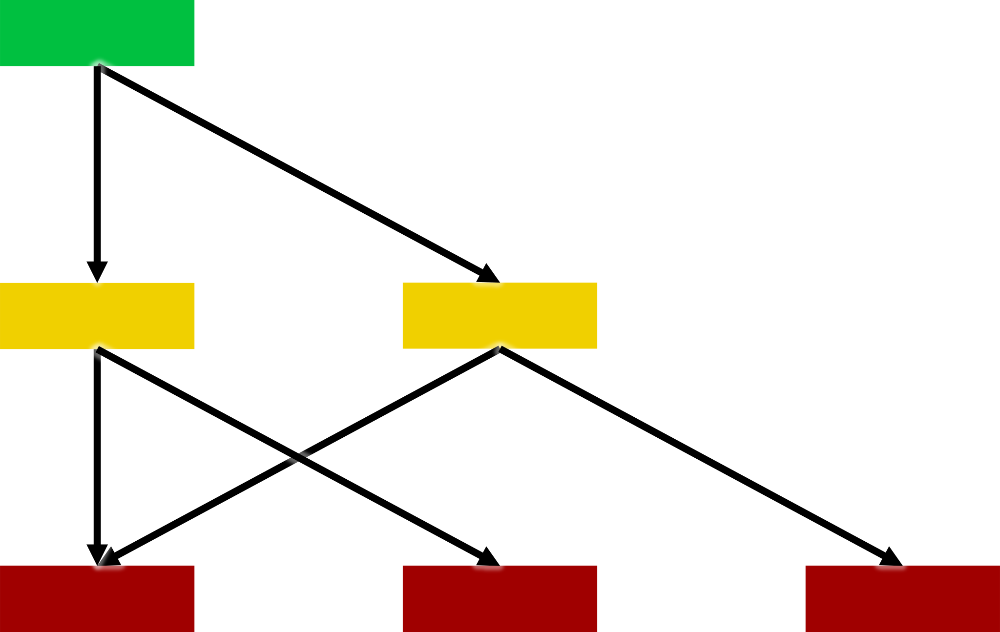
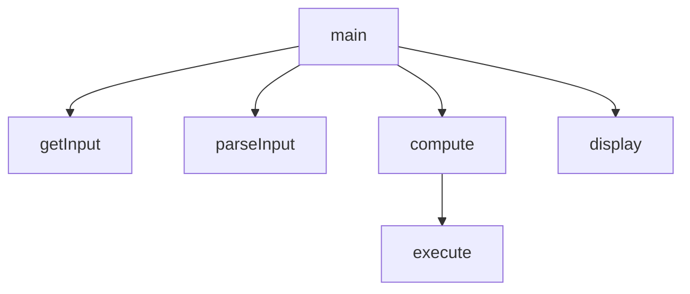

# Conception

Imaginez que, pour afficher "Hello, World !" à l'écran, vous deviez apprendre comment tout fonctionne.
Vous devriez tout apprendre sur les voyants LED au niveau de la physique théorique.
Vous devriez ensuite lire des milliers de pages de fiches techniques sur les processeurs pour savoir quel code écrire en assembleur et comment communiquer avec des périphériques externes.

Au lieu de cela, vous pouvez écrire `print("Hello, World!")` dans un langage tel que Scala ou Python, et le tour est joué.
Le runtime du langage fait tout le travail à votre place, avec l'aide de votre système d'exploitation, qui contient lui-même des pilotes pour le matériel.
Même ces pilotes ne connaissent pas les voyants LED, car l'écran lui-même expose une interface pour afficher les données que les pilotes utilisent.
Python lui-même n'est pas non plus un monolithe : il contient des sous-modules tels qu'un tokenizer, un parseur et un interpréteur.

Malheureusement, il n'est pas facile d'écrire de grandes bases de code de manière claire, et c'est là que la conception entre en jeu.


## Objectifs

À l'issue de ce cours, vous devriez être capable de :
- Écrire du code orienté objet
- Choisir entre héritage et composition
- Appliquer la modularité et l'abstraction en pratique


## Comment encapsuler du code derrière une interface ?

Il ne s'agit ici pas d'interface utilisateur, mais bien d'interface machine : comment est-ce que des parties différentes de votre code peuvent se parler,
sans avoir besoin de connaître tous les détails ?

Avec des fonctions, vous pouvez faire des groupes, mais cela devient vite beaucoup :
```python
def animal_describe(kind): ...
def animal_draw(kind, canvas): ...
def animal_name(kind): ...
def str_replace(s, old, new): ...
def str_capitalize(s): ...
```
Ces fonctions pourraient se partager des variables globales. Par exemple, une méthode `animal_pet` pourrait augmenter une valeur stockée dans une table globale définissant à quel point chaque animal est content.
Cette table pourrait ensuite être lue par la fonction qui décrit un animal.

Mais il est facile de modifier une variable globale de manière non prévue par l'auteur des autres fonctions, ce qui rend le code complexe à modifier.
De plus, avec un éditeur de code, si vous écrivez `animal_` et que votre éditeur vous propose les 50 fonctions et variables commençant par ce nom,
comment sauriez-vous lesquels vous devez utiliser et lesquels sont des détails d'implémentation ?

À la place, on utilise des **objets** en déclarant une classe :
```python
class Animal:
  def describe(self): ...
  def draw(self, canvas): ...
  def name(self): ...
```
On voit déjà qu'au lieu d'avoir des fonctions potentiellement éparses parmi le code source, elles sont toutes au même endroit,
avec `self` indiquant l'"instance" de la classe sur laquelle elles opérent.

De plus, vous pouvez associer des champs à chaque instance afin de conserver un état lié à une instance,
qui est typiquement initialisé dans un _constructeur_:
```python
class Animal:
  def __init__(self, kind):
    self.kind = kind
```
La méthode spéciale `__init__` est celle appelée lorsque vous créez une instance de la classe en utilisant son nom, et ici elle définit le champ `kind` de l'instance :
```python
a = Animal("Chat")
print(a.kind) # Chat
```

Une partie de l'état d'une classe est souvent _privé_, c'est-à-dire que seule la classe peut l'utiliser, ce qui est la base de l'encapsulation.
Par exemple, pour garder une trace de si un animal est content, vous pouvez initialiser un champ privé dans le constructeur :
```python
class Animal:
  def __init__(self, kind):
    self.kind = kind
    self._happy = True
```
Ce champ `_happy` peut ensuite être modifié dans des méthodes telles que "donner à manger à l'animal", "caresser l'animal", "emmener l'animal chez le vétérinaire"...

Comme il commence par un souligné `_`, la convention en Python est que personne ne doit l'utiliser hors de la classe.
Vous pouvez l'utiliser quand même si vous le voulez, mais c'est une mauvaise idée, et la présence d'un souligné `_` vous indique immédiatement que vous faites quelque chose de bizarre.

De même, vous pouvez déclarer des méthodes privées :
```python
class Animal:
  def _increase_happiness(self):
    ...
```

Dans d'autres langages de programmation, comme Java ou C#, le compilateur peut garantir que certains champs sont privés :
```csharp
class Animal {
  private string _happy = true;
}

(new Animal())._happy // erreur, impossible de compiler ce code !
```

Nous avons vu comment déclarer une méthode pour un type de données, mais parfois vous avez besoin de plusieurs fonctions selon le type exact :
```python
def cat_describe(): ...
def dog_describe(): ...
def giraffe_describe(): ...
```
Ceci se fait en programmation orientée objet grâce à l'**héritage** :
```python
class Animal: ...

class Cat(Animal): ...

class Dog(Animal): ...
```
On dit ici qu'un `Cat` _est un_ `Animal`. La "sous-classe" `Cat` hérite des méthodes de la "super-classe" `Animal` et peut redéfinir certaines méthodes :
```python
class Animal:
  def describe(self): return "Un animal"
  def happy(self): return self._happy

class Cat(Animal):
  def describe(self): return "Un chat"
```

Les appels de méthodes sont _dynamiques_, c'est-à-dire qu'ils dépendent du type exact de l'instance sur laquelle ils sont appelés :
```python
def example(a: Animal):
  print(a.describe())

example(Cat()) # "Un chat"
```
Dans cet exemple, même si nous avons donné le type `Animal` au paramètre `a`, puisque nous passons un `Cat`, c'est la méthode `Cat.describe` qui est appelée.

Si besoin, vous pouvez appeler la méthode de la super-classe spécifiquement avec la syntaxe `super().`:
```python
class Dog(Animal):
  def describe(self):
    return "Un chien est " + super().describe()

example(Dog()) # "Un chien est Un animal"
```

Notez qu'en Python, contrairement aux des langages statiquement typés, il n'y a pas besoin d'avoir une super-classe commune pour utiliser deux classes de la même manière.
Si un objet marche comme un canard et fait coin-coin comme un canard, c'est un canard, ce qui donne le nom "duck typing" en anglais.
Par exemple :
```python
class Duck:
  def quack(self): print("Quack")

class Sheep:
  def quack(self): print("Baaa???")
```
Un `Duck` peut `quack`, mais un `Sheep` a apparemment aussi appris à `quack`, donc toute méthode s'attendant à un `Duck` peut aussi utiliser un `Sheep`.
Ce qui ne veut pas forcément dire que c'est une bonne idée !

#### Exercice, partie 1
Ouvrez le fichier [`interactions.py`](./cours/exercices/interactions.py).

Comme indiqué en commentaire, déplacez le code interagissant avec l’utilisateur dans une nouvelle `class UI`.

<details>
<summary>Solution (cliquez pour développer)</summary>
<p>

Par exemple :

```python
class UI:
    def show(self, text):
        print(text)

    def input(self, prompt):
        result = None
        while not result:
            print(prompt)
            result = input()
        return result
```

Le reste du code devient maintenant beaucoup plus clair :
```python
ui = UI()
ui.show('Bonjour !')
name = ui.input('Quel est votre nom ?')
ui.show('Bienvenue, ' + name + '!')
hobby = ui.input('Quel est votre passe-temps préféré ?')
ui.show(hobby + ', quelle bonne idée !')
```

</p>
</details>

#### Exercice, partie 2
Gardez votre solution de la partie 1, et ouvrez le fichier [`interactions-tkinter.py`](./cours/exercices/interactions-tkinter.py).

Les fonctions dans ce fichier permettent d'afficher du texte et de demander du texte à l'utilisateur à l'aide de `tkinter`, sorte de boîte à outils graphique pour des interfaces utilisateur basiques en Python.

Écrivez une classe `GraphicalUI` avec la même interface que `UI`, donc les mêmes noms de méthodes, pour que vous puissiez réutiliser la logique de la partie 1 tout en changeant la manière dont le code interagit avec l'utilisateur.

---

Enfin, avant de passer à la suite, une astuce Python : si vous avez besoin d'une classe juste pour grouper des valeurs, comme par exemple un nom et un age appartenant à une personne,
vous pouvez utiliser `dataclass` pour ne pas avoir à écrire le constructeur `__init__` à la main :
```python
from dataclasses import dataclass

@dataclass
class Person:
    name: str
    age: int

p = Person("Alice", 7)
print(p.name)
```
Nous ne parlerons pas plus de `dataclass`, mais c'est bon à savoir.


## Comment utiliser les objets en pratique ?

Nous venons de voir comment écrire des classes et utiliser l'héritage et les attributs en Python, mais qu'en est-il de la pratique ? Comment choisir ce qui doit être public ou privé, ce qui doit hériter d'une autre classe... ?

Déjà, concernant la distinction public/privé, préférez les méthodes privées et attributs privés par défaut.
Il est facile de changer dans la direction "privé => public", car personne d'autre ne peut utiliser les choses privées, donc donner au reste du code la possibilité d'utiliser quelque chose qui était auparavant privé ne pose pas de problème.
Mais l'inverse n'est pas vrai : changer dans la direction "public => privé" peut causer beaucoup de problèmes, car tout le code qui utilisait ce qui était avant public et est maintenant privé ne fonctionne plus.
Si vous vous rendez compte qu'une méthode n'aurait pas du être publique car elle permet de casser l'encapsulation fournie par sa classe, par exemple, vous devez changer tout le code hors de la classe qui l'utilise.
Dans le cas où votre code est utilisé par d'autres, par exemple si vous avez publié votre code sur un dépôt de paquets afin que d'autres puissent l'utiliser, les utilisateurs ne seront pas content que leur code ne marche plus avec votre nouvelle version qui rend une méthode privée alors qu'elle était publique.

Notons aussi que le fait qu'une classe a des méthodes publiques et privées ne signifie pas qu'on peut toujours la remplacer par une implémentation différente qui fournisse "la même chose", à cause des performances.
Par exemple, une carte de la Terre implémentée avec la [projection de Mercator](https://fr.wikipedia.org/wiki/Projection_de_Mercator) peut très facilement fournir l'opération "quel angle dois-je utiliser pour naviguer entre deux points",
car conserver les angles est justement le but de cette projection.
Vous pourriez changer l'implémentation de la carte pour utiliser une autre projection, mais si calculer un angle est beaucoup plus lent avec votre projection différente, l'implémentation ne sera pas forcément utilisable en pratique avec le niveau de performance attendu.

#### Exercice
Vous implémentez un réseau social et avez besoin de stocker des images.
Pour l'instant, vous stockez ces images sur le disque local de votre machine.

Lesquelles de ces méthodes devraient être préfixées d'un `_` pour indiquer qu'elles sont privées ?
```python
class PictureStorageOnDisk:
  def get_picture(self, id): ...
  def get_file_name(self, id): ...
  def get_all_pictures(self): ...
```

<details>
<summary>Solution (cliquez pour développer)</summary>
<p>

`get_picture` est le but principal de la classe donc doit rester public.

`get_file_name` est un détail d'implémentation. Si vous stockiez les fichiers dans une base de données, ou sur un site externe, le concept même de "nom de fichier" n'aurait pas de sens, cette méthode doit donc être privée.

`get_all_pictures` est discutable. Cela est potentiellement utile pour le reste de l'application, mais selon la manière dont les images sont stockées, cette opération pourrait être extrêmement inefficace, par exemple en téléchargeant des milliers d'images.
Il vaut mieux la laisser en privé jusqu'à ce qu'il y ait un vrai besoin.

</p>
</details>

---

Il est facile de céder à la tentation du "juste au cas où..." et de rendre ses interfaces extrêmement générales.
Le stockage d'images de l'exercice que vous venez de faire pourrait être un stockage de "données" prenant non seulement leur identifiant mais aussi leur type, un Booléen indiquant si un cache local doit être utilisé, et bien d'autres paramètres.
En interne, c'est peut-être comme cela que ce stockage sera implémenté. Mais il vaut mieux garder une interface publique spécifique, qui facilite l'utilisation de la classe.

Un autre choix que vous devez faire en écrivant des classes concerne l'héritage.
Un chat "est un" animal, un participant à un évènement "est une" personne, un sponsor de cet évènement "est une" société.
Par contre, un chat "a une" tête, un participant "a une" adresse email, un sponsor "a un" compte bancaire.

Il est donc normal d'écrire `class Chat(Animal)`, mais pas `class Chat(Tête)`. Ce n'est pas parce qu'on peut utiliser la tête d'un chat pour le caresser qu'un chat est plus généralement une tête.
L'exemple du sponsor est flagrant : oui, un sponsor vous fournit de l'argent pour votre évènement, mais vous ne pouvez pas créer un compte chez votre sponsor pour y verser ou y retirer de l'argent à votre guise !

Gardez à l'esprit le [principe de substitution de Liskov](https://fr.wikipedia.org/wiki/Principe_de_substitution_de_Liskov), nommé d'après [Barbara Liskov](https://fr.wikipedia.org/wiki/Barbara_Liskov),
informaticienne et pionnière de l'abstraction et de l'encapsulation dans les langages de programmation.
Si `X` est un `Y`, alors partout où l'on peut utiliser un `Y`, on peut également utiliser un `X`.
On peut donc utiliser un `Chat` partout où l'on peut utiliser un `Animal` en général. Mais on ne peut pas utiliser un `Participant` partout où l'on peut utiliser une `AdresseEmail`. Les participants ne veulent peut-être même pas que vous connaissiez leur adresse !

Un exemple connu est celui de la classe `Stack` en Java, qui est censé représenter une "pile" où l'on peut déposer des objets en mode "premier arrivé, dernier sorti". Si vous déposez `1, 2, 3`, vous retirez `3, 2, 1` dans l'ordre.
En interne, cette classe pourrait utiliser une représentation similaire à celle d'une "liste" comme la `list` en Python.
Mais comme Java est un des premiers langages orientés objet à être devenu populaire, sa librairie standard contient des erreurs de débutant.
Dans ce cas-ci, `Stack` _hérite_ de la classe pour les listes au lieu d'en _contenir_  une. Donc n'importe qui peut ajouter ou supprimer des objets à n'importe quel index de la pile, ce qui détruit l'encapsulation.

Enfin, gardez à l'esprit que les "types de données" en théorie ne correspondent pas forcément aux types que vous pouvez utiliser en pratique.
Par exemple, un `âge` peut être un `int` en Python, mais cela ne veut pas pour autant dire que `-500` est un âge !
Quand vous réfléchissez au types de vos données, souvenez-vous que vous pouvez être plus précis dans la documentation et avec du code qui vérifie les valeurs que les types généraux que vous avez à disposition.
Certains langages vous permettent d'ailleurs d'être plus précis que Python et de définir vous-même des types comme "les entiers de 0 à 9 inclus".

Les types de données sont parfois définis en fonction d'autres types. "Une liste", implicitement, c'est une liste de quelque chose, par exemple une `list[int]`, une `list[str]`, ou même une `list[list[int]]`.
Cela mène à une intersection intéressante avec l'héritage.
Sachant qu'un `Chat` est un `Animal`, est-ce qu'une `Image[Chat]` est une `Image[Animal]` ? Oui, clairement.
Est-ce que de la `NourriturePour[Chat]` est plus généralement de la `NourriturePour[Animal]` ? Non ! Tous les animaux ne peuvent pas manger tout ce que les chats peuvent manger.
Par contre, si vous avez de la `NourriturePour[Animal]` en général, c'est de la `NourriturePour[Chat]` puisque si quelque chose convient à tous les animaux, cela convient clairement aux chats.

Et nos listes ? Est-ce qu'une `list[Chat]` est une `list[Animal]` ?
Si c'était le cas, on pourrait écrire du code comme cela :
```python
def add_tiger(lst: list[Animal]): ...

lst = [giraffe1, giraffe2]
add_tiger(lst) # oups, on ajoute un tigre dans une liste de girafes, pauvres girafes
```
Est-ce donc l'inverse ? Une `list[Animal]` est-elle une `list[Chat]` ? Non plus, si on retire un élément de la liste, c'est un `Animal` mais pas forcément un `Chat`. Il n'y a donc aucune relation d'héritage entre `list[Chat]` et `list[Animal]`.

Formellement, on parle de "variance" :
- La **covariance**, c'est l'usage en sortie : une image de chat est une image d'animal
- La **contravariance**, c'est l'usage en entrée : la nourriture pour animal est de la nourriture pour chat
- L'**invariance**, c'est ni l'un ni l'autre : une liste de chats et une liste d'animaux ne peuvent pas être utilisées l'une pour l'autre


## Comment concevoir de grands systèmes logiciels ?

[Barbara Liskov](https://en.wikipedia.org/wiki/Barbara_Liskov), que nous venons de voir ci-dessus,
a un jour [fait remarquer](https://infinite.mit.edu/video/barbara-liskov) que _la technique de base dont nous disposons pour gérer la complexité des logiciels est la modularité_.

La modularité consiste à diviser et subdiviser les logiciels en unités indépendantes qui peuvent être maintenues séparément et réutilisées dans d'autres systèmes : les modules.
Chaque module possède une interface, qui est ce que le module expose au reste du système. Le module abstrait certains concepts et présente cette abstraction au monde.
Le code qui utilise le module n'a pas besoin de savoir ni de se soucier de la manière dont l'abstraction est mise en œuvre, mais seulement de son existence.

Par exemple, il n'est pas nécessaire de s'y connaître en menuiserie ou en textiles pour comprendre comment utiliser un canapé.
Certains canapés peuvent même être personnalisés par les clients, qui peuvent par exemple choisir d'y ajouter un compartiment de rangement ou un lit convertible, car les canapés sont composés de sous-modules.

En programmation, l'interface d'un module est généralement appelée "API", abréviation de "Application Programming Interface" (interface de programmation d'application).
Les API contiennent des objets, des fonctions, des erreurs, des constantes, etc.
Ce n'est pas la même chose que le concept d'"interface" dans les langages de programmation tels que Java.
Dans cette leçon, nous aborderons la notion générale d'interface, et non la mise en œuvre spécifique de ce concept dans un langage particulier.

Prenons l'exemple de la fonction Python suivante :
```python
def compute(expr: str) -> int:
  # ...
```
Elle peut être considérée comme un module dont l'interface est la signature de la fonction.
Les utilisateurs de ce module n'ont pas besoin de savoir comment le module calcule les expressions, par exemple en renvoyant `4` pour `2 + 2`. Ils ont seulement besoin de comprendre son interface.

Une interface similaire peut être écrite dans une technologie différente, telle que COM de Microsoft :
```cpp
[uuid(a03d1424-b1ec-11d0-8c3a-00c04fc31d2f)] 
interface ICalculator : IDispatch {
  HRESULT Compute([in] BSTR expr,
                  [out] long* result);
};
```
Il s'agit de l'interface d'un composant COM, conçue pour être utilisable et implémentable dans différents langages.
Elle définit fondamentalement le même concept que celle de Python, à l'exception d'une manière différente de définir les erreurs (exceptions vs codes `HRESULT`)
et de renvoyer les données (valeurs de retour vs paramètres `[out]`).
Tout le monde peut utiliser ce module COM grâce à son interface, sans avoir à connaître ou à se soucier de la manière dont il est implémenté et dans quel langage.

Un autre type d'interface inter-programmes est HTTP, qui peut être utilisé via des frameworks serveur :
```java
@Get("/api/v1/calc")
String compute(@Body String expr) {
  // ...
}
```
L'interface de ce serveur HTTP est `HTTP GET /api/v1/calc`, sachant que le seul paramètre doit être transmis dans le corps et que la valeur renvoyée sera une chaîne de caractères.
Le nom de la méthode Java ne fait pas partie de l'interface, car il n'est pas exposé au monde extérieur. De même, le nom du paramètre `expr` n'est pas exposé non plus.

Ces trois interfaces peuvent être utilisées dans un seul système qui combine trois modules : un serveur HTTP qui appelle en interne un composant COM qui appelle en interne une fonction Python.
Le serveur HTTP n'a même pas besoin de savoir que la fonction Python existe s'il passe par le composant COM, ce qui simplifie son développement.

Cependant, cela nécessite une certaine discipline dans l'application des modules. Si la fonction Python crée un fichier sur le disque local et que le serveur HTTP décide d'utiliser ce fichier, la modularité est rompue.
Ce problème existe également au niveau des fonctions. Considérons la même fonction Python que ci-dessus, mais cette fois avec une fonction supplémentaire :
```python
def compute(expr: str) -> int:
  # ...

def useReversePolishNotation():
  # ...
```
La deuxième fonction sert à configurer le comportement de la première.
Cependant, elle crée une dépendance entre deux modules qui utilisent `compute`, car ils doivent s'accorder sur l'utilisation ou non de `useReversePolishNotation`.
Si un module tente d'utiliser `compute` en supposant la notation standard, mais qu'un autre module du système a choisi d'utiliser la notation polonaise inversée, le premier échouera.

Un autre problème courant avec les modules est l'exposition volontaire d'informations non nécessaire, généralement parce que cela simplifie l'implémentation à court terme.
Par exemple, une classe `User` avec un `name` et une `favoriteFood` devrait-elle également avoir un attribut booléen `fetchedFromDatabase` ?
Cela peut avoir du sens dans une implémentation spécifique, mais le concept de suivi des aliments préférés des utilisateurs n'a absolument rien à voir avec une base de données.
Les programmeurs écrivant du code qui utilise cette classe `User` devraient connaître les bases de données pour comprendre le concept d'utilisateur du système,
et les responsables de la maintenance de la classe `User` elle-même ne pourraient plus modifier l'implémentation pour la rendre indépendante des bases de données, car l'interface impose un lien entre les deux concepts.
De même, au niveau du paquet, un paquet `calc` pour une application de calculatrice avec une classe `User` et une classe `Calculator` ne devrait probablement pas avoir de classe `UserInterfaceCheckbox`, car il s'agit d'un concept de niveau beaucoup plus bas.

---
#### Exercice
À quoi ressemblerait l'interface d'une classe `Student`...
- ... pour une application "compagnon" de campus ?
- ... pour un système de gestion des cours ?
- ... pour un système d'authentification ?
En quoi diffèrent-elles et pourquoi ?
<details>
<summary>Solution proposée (cliquez pour développer)</summary>
<p>

Une application pour le campus pourrait considérer les étudiants comme ayant un nom et des préférences, par exemple s'ils souhaitent que les menus végétariens s'affichent en premier ou dans quel ordre afficher les cours de l'utilisateur.

Mais cette application ne se soucie pas de savoir si l'étudiant a payé ses frais pour le semestre en cours, ce qui pourrait intéresser un système de gestion des cours,
ni de la filière dans laquelle il est inscrit.

Ni l'application ni le système de gestion des cours ne doivent connaître le mot de passe de l'utilisateur, ni même le concept de mot de passe, car l'utilisateur peut se connecter à l'aide de données biométriques ou d'une authentification à deux facteurs.
Ces concepts sont ceux qui intéressent le système d'authentification pour les étudiants.

</p>
</details>

## Qu'est-ce que la modularité exige dans la pratique ?

Il est trop facile d'écrire des systèmes logiciels dans lesquels chaque « module » est un mélange hétéroclite de concepts, les modules dépendant les uns des autres sans schéma clair.
La maintenance d'un tel système nécessite de lire et de comprendre la majeure partie du code du système, ce qui n'est pas adapté aux grands systèmes.
Nous avons vu les avantages théoriques et les pièges de la modularité, voyons maintenant comment concevoir des systèmes modulaires dans la pratique.

Nous aborderons la régularité des interfaces, le regroupement et la stratification des modules, ainsi que l'organisation des modules par niveau d'abstraction.

### Régularité

Prenons l'exemple d'une fractale telle que celle-ci :

<p align="center"></p>

Cette image peut sembler complexe, mais comme il s'agit d'une fractale, elle est très régulière.
Elle peut être [formellement définie](https://en.wikipedia.org/wiki/Mandelbrot_set#Formal_definition) à l'aide d'une courte équation mathématique et d'une courte phrase.
Comparez-la à cette image :

<p align="center"></p>

Il s'agit d'un bruit aléatoire. Il ne présente aucune régularité. La seule façon de le décrire est de décrire chaque pixel tour à tour, ce qui prend beaucoup de temps.

L'idée que les choses doivent être régulières et pouvoir être décrites en quelques mots s'applique également au code.
Considérons l'extrait suivant du package `java.util` de Java :
```java
class Stack {
  /** Renvoie la position basée sur 1 où se trouve un objet dans cette pile. */
  int search(Object o);
}
```
Pour une raison quelconque, `search` renvoie une position basée sur 1, alors que tous les autres index en Java sont basés sur 0.
Ainsi, toute description de `search` doit inclure cette information, et un coup d'œil rapide au code qui utilise `search` peut manquer un bug si l'index est accidentellement utilisé comme s'il était basé sur 0.

Il convient de suivre le "principe de moindre surprise", c'est-à-dire que les choses doivent se comporter de la manière dont la plupart des gens s'y attendent, et donc ne pas déroger aux règles courantes.
Un autre exemple tiré de Java est la méthode `equals` de la classe `URL`.
On pourrait s'attendre à ce que, comme toute autre vérification d'égalité en Java, `URL::equals` vérifie les champs des deux objets, ou peut-être un sous-ensemble de ceux-ci.
Cependant, ce qu'elle fait [en réalité](https://docs.oracle.com/en/java/javase/17/docs/api/java.base/java/net/URL.html#equals(java.lang.Object)), c'est vérifier si les deux URL renvoient à la même adresse IP.
Cela signifie que le résultat dépend du fait que les deux URL pointent vers la même adresse IP à ce moment précis, et même du fait que la machine sur laquelle le code est exécuté dispose d'une connexion Internet.
La résolution des adresses IP prend également du temps, ce qui est beaucoup plus lent que les méthodes equals habituelles qui vérifient l'égalité des champs.

Une manière plus formelle d'appréhender la régularité est la [complexité de Kolmogorov](https://fr.wikipedia.org/wiki/Complexit%C3%A9_de_Kolmogorov) : combien de mots faut-il pour décrire quelque chose ?
Par exemple, la fractale ci-dessus a une faible complexité de Kolmogorov, car elle peut être décrite en très peu de mots. On peut écrire un petit programme informatique pour la produire.
En comparaison, le bruit aléatoire ci-dessus a une complexité de Kolmogorov élevée, car il ne peut être décrit qu'avec de nombreux mots. Un programme permettant de le produire doit générer chaque pixel individuellement.
Tout module dont la description doit inclure "et..." ou "sauf..." a une complexité de Kolmogorov plus élevée que nécessaire.

### Groupes

Qu'ont en commun les classes suivantes ? `Map<K, V>, Base64, Calendar, Formatter, Optional<T>, Scanner, Timer, Date`.

Pas grand-chose, n'est-ce pas ? Pourtant, elles se trouvent toutes dans le même package `java.util` de la bibliothèque standard Java.
Ce n'est pas une bonne interface de module : elle contient un ensemble d'éléments sans rapport les uns avec les autres !
Si vous voyez qu'un programme Java dépend de `java.util`, cela ne vous apprend pas grand-chose, car il s'agit d'un module très vaste.

Et les classes suivantes ? `Container, KeysView, Iterable, Sequence, Collection, MutableSet, Set, AsyncIterator`.

C'est beaucoup plus simple : ce sont toutes des collections, et elles se trouvent effectivement dans le module collections de Python.
Malheureusement, ce module s'appelle `collections.abc`, car c'est un acronyme amusant pour "abstract base classes" (classes de base abstraites), ce qui n'est pas un très bon nom pour un module.
Mais au moins, si vous voyez qu'un programme Python dépend de `collections.abc`, après avoir recherché le nom, vous savez maintenant qu'il utilise des structures de données.

L'importance de regrouper les éléments connexes explique pourquoi les variables globales posent un tel problème.
Si plusieurs modules accèdent tous à la même variable globale, ils forment alors tous un seul module, car un programmeur doit comprendre comment chacun d'entre eux utilise la variable globale pour pouvoir les utiliser.
Le regroupement effectué par les variables globales est accidentel et a donc peu de chances de produire des groupes utiles.

### Couches

Vous connaissez peut-être déjà les couches de la pile réseau : la couche application utilise la couche transport, qui utilise la couche réseau, et ainsi de suite jusqu'à la couche physique au niveau le plus bas.
La couche application n'utilise pas directement la couche réseau et ne sait même pas qu'il existe une couche réseau. La couche réseau ne sait pas non plus qu'il existe une couche application ou une couche transport.

Séparer un système en couches est un moyen de définir les dépendances entre les modules de manière minimale et gérable, de sorte que la maintenance d'un module puisse être effectuée sans connaissance de la plupart des autres modules.

Il peut y avoir plusieurs modules à un niveau donné : par exemple, une application peut utiliser des modules mobiles et serveurs, qui forment la couche inférieure à celle dans laquelle est le module "application".
Le module serveur lui-même peut dépendre d'un module d'authentification et d'un module de base de données, qui forment la couche inférieure, et ainsi de suite.

Ainsi, la couche `N` dépend _uniquement_ de la couche `N-1`, et le contexte pour l'implémentation de la couche `N` est l'interface de la couche `N-1`.
En construisant des couches dans une pile, on minimise le contexte de l'implémentation de chaque couche.

Cependant, il est parfois nécessaire qu'une couche prenne des décisions en fonction d'une logique de niveau supérieur, comme le type de comparaison à utiliser dans une fonction de tri.
Donner des connaissances sur les éléments de niveau supérieur dans la fonction de tri romprait la stratification et rendrait plus difficile la maintenance de la fonction de tri.
Au lieu de cela, on peut injecter une fonction de « comparaison » comme paramètre de la fonction de tri :
```python
def sort(items, less_than):
  ...
  if less_than(items[i], items[j]):
    ...
```
Les couches de niveau supérieur peuvent ainsi transmettre une fonction de comparaison de niveau supérieur, et la fonction de tri n'a pas besoin de dépendre explicitement d'une couche supérieure, ce qui résout le problème.
Cela peut également être fait avec des objets en transmettant d'autres objets comme paramètres de constructeur, et même avec des paquets dans les langages qui le permettent, tels que [Ada](https://en.wikipedia.org/wiki/Ada_(programming_language)).

La stratification explique également la différence entre l'héritage, tel que `class MyApp(MobileApp)`, et la composition, telle que `class MyApp: def __init__(self, app: MobileApp): ...`.
Le premier nécessite que `MyApp` expose toute l'interface de `MobileApp` en plus de la sienne, tandis que le second permet à `MyApp` de choisir ce qu'il souhaite exposer et d'utiliser éventuellement `MobileApp` pour implémenter son interface :

<p align="center"></p>

Dans la plupart des cas, la composition est le choix approprié pour éviter d'exposer des détails non pertinents aux couches de niveau supérieur.
Cependant, l'héritage peut être utile si les modules se trouvent logiquement dans la même couche, comme `LaserPrinter` et `InkjetPrinter` qui héritent tous deux de `Printer`.


### Niveaux d'abstraction

Un câble à fibre optique offre un niveau d'abstraction très bas, qui traite la lumière pour transmettre des bits individuels.
Le protocole Ethernet offre un niveau d'abstraction plus élevé, qui traite les adresses MAC et transmet des octets.
Une application mobile offre un niveau d'abstraction encore plus élevé, qui traite les requêtes et les réponses pour transmettre des informations telles que les menus quotidiens des cafétérias.

Si vous deviez mettre en œuvre une application mobile et que vous ne disposiez que d'un câble à fibre optique, vous passeriez la plupart de votre temps à réimplémenter des abstractions intermédiaires,
car il est difficile de définir une demande pour le menu du jour en termes de bits individuels.

Mais si vous deviez mettre en œuvre une extension de câble à fibre optique et que vous ne disposiez que de l'abstraction de haut niveau des menus quotidiens de la cafétéria, vous ne seriez pas en mesure de faire votre travail.
L'abstraction de haut niveau est pratique pour les opérations de haut niveau, mais elle cache volontairement les détails de bas niveau.

Lorsque vous concevez un module, réfléchissez à son niveau d'abstraction : où se situe-t-il dans le spectre des abstractions de bas niveau à haut niveau ?
Si vous fournissez une abstraction d'un niveau supérieur à celui qui est nécessaire, les autres ne pourront pas faire leur travail car ils ne pourront pas accéder aux informations de bas niveau dont ils ont besoin.
Si vous fournissez une abstraction d'un niveau inférieur à celui qui est nécessaire, les autres devront passer beaucoup de temps à réinventer la roue de haut niveau par-dessus votre abstraction de bas niveau.

Vous n'êtes pas toujours obligé de choisir un seul niveau d'abstraction : vous pouvez en exposer plusieurs.
Par exemple, une bibliothèque peut exposer un module pour transmettre des bits sur fibre optique, un module pour transmettre des paquets Ethernet et un module pour effectuer des requêtes de haut niveau.
En interne, le module de requête de haut niveau peut utiliser le module Ethernet, qui peut utiliser le module de fibre optique. Ou pas ; vos clients n'ont aucun moyen de le savoir, et ils n'ont aucune raison de s'en soucier,
tant que vos modules fournissent des implémentations fonctionnelles des abstractions qu'ils exposent.

Un exemple concret de niveaux d'abstraction différents est l'affichage d'un triangle à l'aide d'un GPU, qui est l'équivalent graphique de l'impression du texte "Hello, World !".
À l'aide d'une API de haut niveau telle que [GDI](https://fr.wikipedia.org/wiki/Graphics_Device_Interface), l'affichage d'un triangle nécessite environ 10 lignes de code.
Vous pouvez créer un objet fenêtre, créer un objet triangle, configurer les couleurs de ces objets et les afficher.
À l'aide d'une API de bas niveau telle que [OpenGL](https://fr.wikipedia.org/wiki/OpenGL), l'affichage d'un triangle nécessite environ 100 lignes de code, car vous devez traiter explicitement certains détails de bas niveau.
En utilisant une API de niveau encore plus bas telle que [Vulkan](https://fr.wikipedia.org/wiki/Vulkan_(API)), l'affichage d'un triangle nécessite environ 1'000 lignes de code,
car vous devez gérer explicitement tous les concepts GPU de bas niveau que même OpenGL abstrait. Chaque partie du pipeline graphique doit être configurée dans Vulkan.
Mais cela ne fait pas de Vulkan une "mauvaise" API, seulement une API qui n'est pas adaptée aux tâches de haut niveau telles que l'affichage de triangles.
Au contraire, Vulkan et les API similaires telles que [Direct3D 12](https://fr.wikipedia.org/wiki/Direct3D) sont destinées à être utilisées pour les moteurs de jeux et autres abstractions "intermédiaires" qui
fournissent elles-mêmes des abstractions de plus haut niveau. Par exemple, OpenGL peut être implémenté comme une couche au-dessus de Vulkan.
Sans ces abstractions de bas niveau, il serait impossible de mettre en œuvre efficacement des abstractions de haut niveau. En effet, les performances ont été la principale motivation pour la création d'API telles que Vulkan.

Lors de la mise en œuvre d'une abstraction par dessus une abstraction de niveau inférieur, il est important d'éviter les "fuites d'abstraction".
Une fuite d'abstraction se produit lorsqu'un détail de bas niveau "fuite" d'une abstraction de haut niveau, obligeant les utilisateurs de l'abstraction à comprendre et à gérer des détails de bas niveau qui ne les concernent pas.
Par exemple, si la fonction permettant d'afficher le menu du jour a la signature `def showMenu(date, useIPv4)`, toute personne souhaitant écrire une application qui affiche des menus doit
réfléchir explicitement à la question de savoir si elle souhaite utiliser IPv4, un détail de niveau inférieur qui ne devrait pas être pertinent dans ce contexte.
Notez que le terme "fuite d'abstraction" n'est pas lié à une "fuite de sécurité", bien que les deux soient des fuites.

### Récapitulatif

Concevez des systèmes de manière à ce que chaque module dispose d'une API standard qui fournit une abstraction cohérente.
Structurez vos modules en couches afin que chaque module ne dépende que des modules de la couche immédiatement inférieure, et que les couches soient classées par niveau d'abstraction.
Par exemple, voici une conception dans laquelle le module vert fournit une abstraction de haut niveau et dépend des modules jaunes, qui fournissent des abstractions de niveau inférieur,
et qui dépendent eux-mêmes des modules rouges et de leurs abstractions de niveau inférieur :

<p align="center"></p>

Une façon de procéder au niveau des fonctions individuelles consiste à écrire d'abord le module de haut niveau, avec une interface de haut niveau,
et une implémentation qui utilise des fonctions que vous n'avez pas encore écrites.
Par exemple, pour une méthode qui prédit la météo :

```python
def predictWeather(date):
    past = getPastWeather(date)
    temps = extractTemperatures(past)
    return predict(temps)
```

Après cela, vous pouvez implémenter `getPastWeather` et d'autres, eux-mêmes en termes d'interfaces de niveau inférieur, jusqu'à ce que vous implémentiez vous-même le niveau le plus bas ou que vous réutilisiez le code existant pour cela.
Par exemple, `getPastWeather` sera probablement implémenté avec une bibliothèque HTTP, tandis que `extractTemperature` sera défini en fonction du format de `past`.

---
#### Exercice
Regardez `calc.py` dans les [exercices pendant le cours](exercises/cours). Il mélange toutes sortes de concepts. Modularisez-le !
Réfléchissez aux modules dont vous avez besoin et à la manière dont vous devriez concevoir le système dans son ensemble.
Tout d'abord, à quoi ressemblera le code de haut niveau ?
<details>
<summary>Solution proposée (cliquez pour développer)</summary>
<p>

Créez une fonction pour obtenir les entrées de l'utilisateur, une pour les analyser en un format interne, une pour évaluer ce format et une pour afficher le résultat ou l'absence de résultat.
La fonction d'évaluation peut utiliser en interne une autre fonction pour exécuter chaque opérateur individuellement, de sorte que tous les opérateurs se trouvent au même endroit et soient indépendants de l'analyse des entrées.
Vous pouvez donc avoir la structure suivante :



</p>
</details>

---

À ce stade, vous vous demandez peut-être jusqu'où aller dans la modularisation. Vos programmes doivent-ils être composés de milliers de petits modules empilés sur des centaines de couches ?
Probablement pas, car cela poserait des problèmes de maintenabilité, tout comme le fait d'avoir un seul grand module pour tout. Mais où s'arrêter ?

Il n'existe pas de mesure objective unique pour déterminer la taille d'un module, mais voici quelques règles empiriques.
Vous pouvez estimer la taille à l'aide du nombre de chemins logiques dans un module. Combien de choses différentes le module peut-il faire ?
Si vous obtenez plus d'une douzaine, le module est probablement trop grand.
Vous pouvez estimer la complexité à l'aide du nombre d'entrées pour un module. De combien d'éléments le module a-t-il besoin pour fonctionner ?
Si ce nombre est supérieur à quatre ou cinq, le module est probablement trop grand.

Souvenez-vous de l'acronyme YAGNI, qui signifie "You Aren't Gonna Need It" : vous n'en aurez pas besoin).
Vous pourriez diviser un module en trois parties encore plus petites qui pourraient théoriquement être réutilisées individuellement, mais en aurez-vous besoin ? Non ? Vous n'en aurez pas besoin, alors ne le faites pas.
Vous pourriez fournir dix paramètres différents pour un module afin de configurer chaque détail de ce qu'il fait, mais en aurez-vous besoin ? Non ? Vous n'en aurez pas besoin, alors ne le faites pas.

Une façon de discuter des conceptions avec vos collègues consiste à utiliser des diagrammes tels que les [diagrammes de classes UML](https://fr.wikipedia.org/wiki/Diagramme_de_classes),
dans lesquels vous dessinez des modules avec leurs données et leurs opérations et vous les reliez pour indiquer les relations de composition et d'héritage.
Gardez à l'esprit que l'objectif est de discuter de la conception du système, et non de respecter des conventions spécifiques.
Tant que tout le monde s'accorde sur la signification de chaque élément du diagramme, le fait de respecter ou non une convention spécifique telle que l'UML n'a aucune importance.

Méfiez-vous du phénomène connu sous le nom de "[cargo cult programming](https://en.wikipedia.org/wiki/Cargo_cult_programming)".
L'idée d'un "culte du cargo" trouve son origine dans des îles isolées utilisées comme bases par les soldats américains pendant les guerres.
Ces îles abritaient des populations indigènes qui n'avaient aucune idée de ce qu'étaient les avions, mais qui avaient remarqué que lorsque les soldats faisaient des gestes spécifiques impliquant du matériel militaire,
des avions-cargos remplis de provisions atterrissaient sur les îles. Ils ont naturellement émis l'hypothèse que s'ils pouvaient reproduire ces mêmes gestes, d'autres avions atterriraient !
Bien sûr, de notre point de vue, nous savons que cela était inutile, car ils avaient inversé la corrélation : les soldats faisaient des gestes d'atterrissage parce qu'ils savaient que des avions allaient arriver, et non l'inverse.
Mais les autochtones ne le savaient pas et essayaient de faire atterrir des avions-cargos.
Certaines de ces croyances ont perduré plus longtemps qu'elles n'auraient dû, et leur équivalent moderne en programmation sont les ingénieurs qui conçoivent leur système
"parce que certaines grandes entreprises, comme Google ou Microsoft, le font de cette façon", sans savoir ni comprendre pourquoi ces grandes entreprises le font ainsi.
En général, les grands systèmes des grandes entreprises ont des contraintes qui ne s'appliquent pas à la grande majorité des systèmes, comme le traitement de milliers de requêtes par seconde ou la nécessité de fournir des garanties de disponibilité extrêmes.
