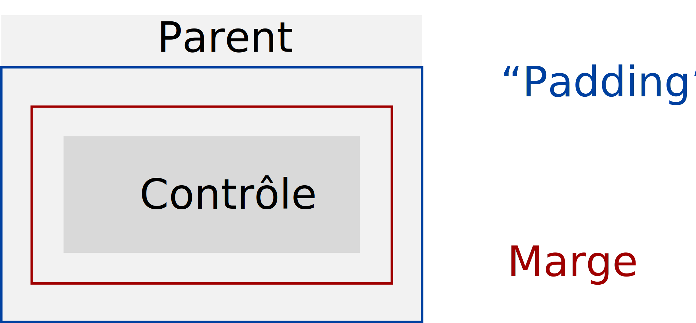
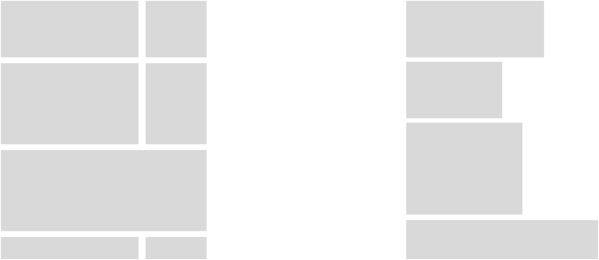
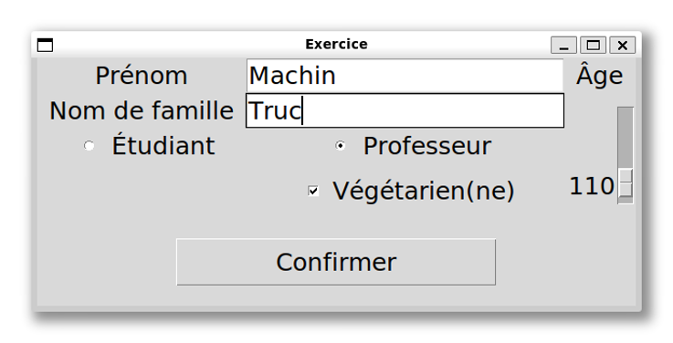
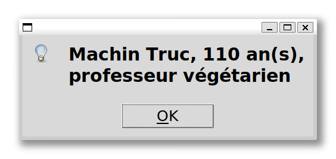
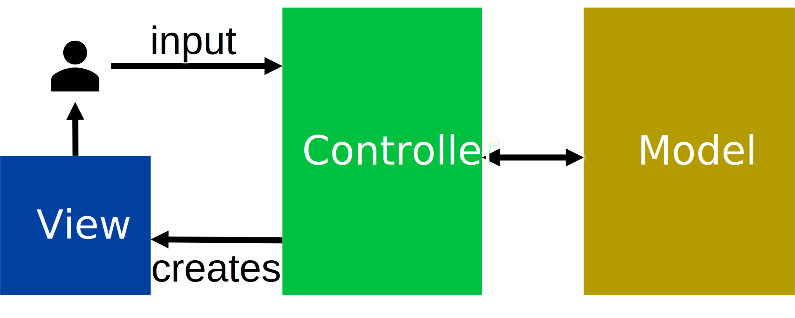
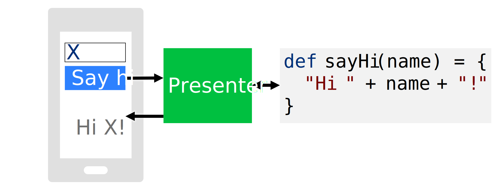
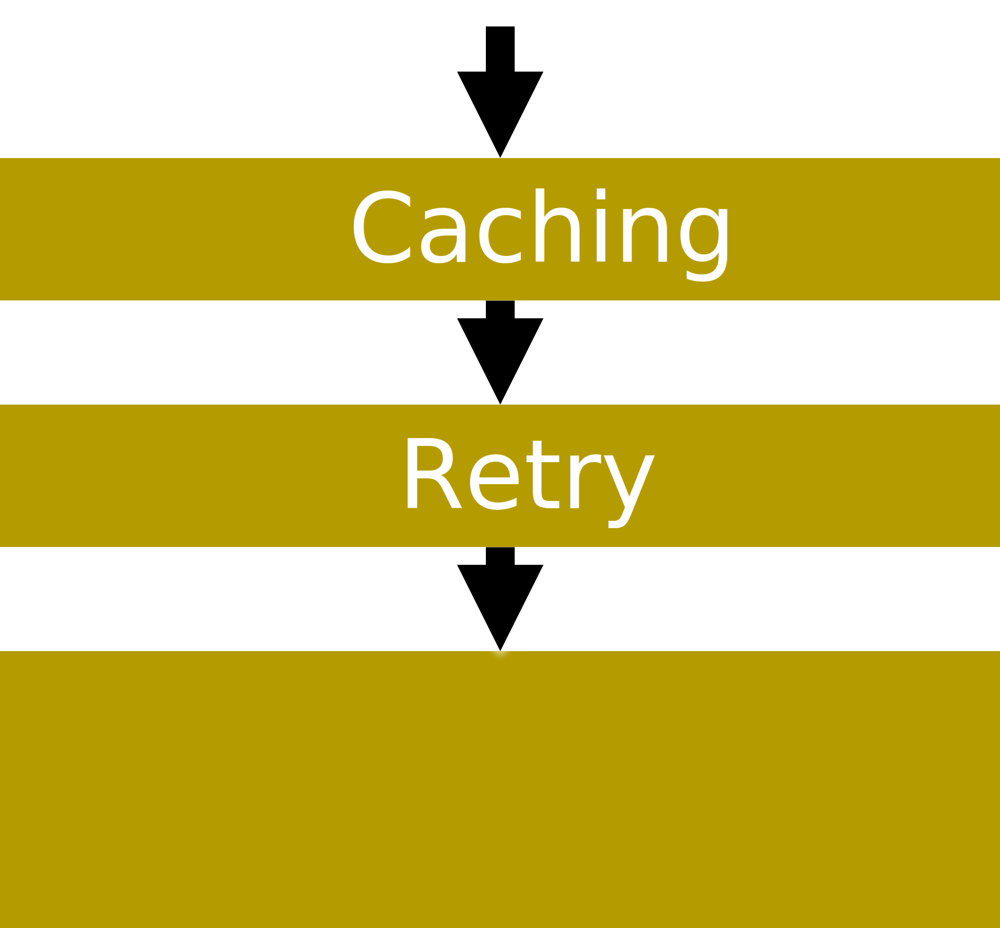
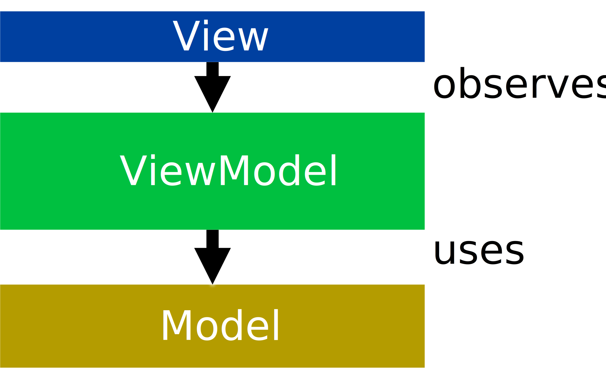

# Interfaces graphiques et APIs

Quand on programme pour soi-même, il est souvent plus simple de créer une interface en ligne de commande basique.
De plus, beaucoup de petits scripts et programmes simples ne communiquent pas avec le reste du monde, ou le font via des fichiers téléchargés manuellement.

Mais pour développer un produit logiciel, il est en général nécessaire d'avoir une interface _graphique_, et de communiquer avec des services externes via des _APIs_, pour "Application Programming Interfaces".
De plus, il est souvent nécessaire d'extraire la logique réutilisable d'une application pour pouvoir développer plusieurs interfaces, par exemple mobile et bureau, et pour réutiliser certains modules dans différentes applications.


## Objectifs

Après ce cours, vous devriez être en mesure de :
- Concevoir des interfaces utilisateur graphiques
- Organiser le code avec des design patterns
- Découpler l'UI, la logique, et les strategies réutilisables
- Interagir avec des services externes via des APIs


## Comment concevoir une interface graphique ?

Il y a en gros deux types de contrôles dans une interface graphique : les entrées et les sorties.
Les entrées incluent des entrées de texte, de nombres, de fichiers, et d'autres types de données, ainsi que des exécutions de fonctions via, par exemple, des boutons.
Certaines entrées sont plus spécifiques, par exemple "addresse email" et non simplement "texte".
Les sorties incluent de l'affichage de texte, d'image, de son, et d'autres types de données.

En général, tant les entrées que les sorties ont des _propriétés_ communes, telles que leur visibilité (visible, caché), leur opacité, la couleur du texte s'il y en a, la couleur de fond, et bien d'autres.
De plus, les contrôles dans une interface utilisateur fournissent des _évènements_, c'est-à-dire un moyen d'appeler des fonctions spécifiques quand quelque chose se passe, comme "clic", "double clic", ou "clic droit".

Les interfaces utilisateurs sont en général modélisées à l'aide de concepts orientés objets, soit l'héritage et la composition.
Par exemple, une classe de base représente tous les contrôles, et a des sous-classes telles que "boîte d'entrée de texte", "label", et "image".
La boîte d'entrée de texte peut elle-même avoir une sous-classe pour entrer un mot de passe, qui montre des astérisques au lieu du mot de passe que l'utilisateur écrit.
De plus, des contrôles en contiennent d'autres, comme par exemple une liste d'onglets qui chacun peut contenir d'autres contrôles.
Un onglet qui affiche une image n'_est pas_ une image, mais il _a_ une image, c'est donc de la composition et non de l'héritage.

Avant de passer à un exemple, voyons concepts généraux qui sont présents dans les interfaces graphiques quel que soit le langage ou framework.
D'abord, les marges, typiquement le "padding" qui est une marge à l'intérieur d'un contrôle parent et la marge à l'extérieur d'un contrôle enfant :

<p align="center"></p>

Ensuite, la mise en page. Il existe énormément de types de mise en page, comme les grilles dans lesquels chaque contrôle occuppe une ou plusieurs cellules, l'entassement horizontal ou vertical, et bien d'autres :

<p align="center"></p>


### Exemple en Python : `tkinter`

Le framework `tkinter` en Python est intégré à la librairie standard, raison pour laquelle nous allons l'utiliser comme exemple.
Chaque framework d'interface graphique fait certaines tâches de manière différente, mais les concepts généraux sont les mêmes.

Créez un fichier Python et commencez par importer `tkinter` :
```python
import tkinter
```

Ensuite, créez une fenêtre principale, donnez-lui un nom, et définissez sa taille :
```python
# Créee la fenêtre principale
root = tkinter.Tk()
# Optionnel : Augmente la taille des contrôles Tkinter, très petits par défaut
root.tk.call('tk', 'scaling', 2.5)
# Définit le titre et la taille de la fenêtre principale, ainsi que sa position à l'écran
root.title("Exercice")
root.geometry("500x700+200+200")
```

Vous pouvez maintenant afficher la fenêtre :
```python
# Lance la boucle principale Tkinter : affichage + attente d'entrée utilisateur
root.mainloop()
```
Cela lance la fenêtre, qui est évidemment vide.

Le reste du code de cet exemple doit apparaître **avant l'appel à `mainloop`**.

Commençons par afficher du texte à l'aide d'un `Label` :
```python
label = tkinter.Label(root, text = "Hello, World!")
label.grid(row=0, column=0)
```
Si vous lancez le code, vous devriez voir une fenêtre avec le texte "Hello, World!" en haut à gauche.
Nous avons placé le label sur la ligne 0 et colonne 0, ce qui ne change rien pour l'instant puisqu'il n'y a rien d'autre.

Ajoutons donc une entrée textuelle, le contrôle `Entry` :
```python
entry = tkinter.Entry(root)
entry.grid(row=0, column=1)
```
Si vous lancez le code, vous verrez une boîte de texte directement à droite du texte "Hello, World!", puisque l'`Entry` est sur la colonne 1 mais toujours sur la ligne 0.

Maintenant, un bouton :
```python
bt = tkinter.Button(root, text="Click", padx=60, pady=5)
bt.grid(row=1, columnspan=2, pady=20)
```
Ce bouton existe mais ne fait rien.
Remarquez que avec `columnspan=2`, notre bouton s'étend ("spans" en anglais, d'où le nom de la propriété) sur deux colonnes, et avec `pady=20`, nous ajoutons de la marge à gauche et à droite du texte à l'intérieur.

Pour ajouter une commande, on peut `bind` l'évènement `<Button-1>` à une fonction qui affiche une fenêtre avec le texte de l'entrée :
```python
import tkinter.messagebox as msg
def onclick(e):
  msg.Message().show(message=entry.get(), type=msg.OK)
bt.bind("<Button-1>", onclick)
```
Lancez le code, écrivez du texte dans l'entrée textuelle, et cliquez sur le bouton.
Vous pouvez également changer l'évènement, par exemple `<Button-2>` est le clic droit, vous pouvez trouver [des listes en ligne](https://stackoverflow.com/a/32289245/3311770) de tous les évènements.

Ajoutons un autre type d'entrée, une boîte à cocher, souvent appelée "checkbox", que `tkinter` appelle `Checkbutton` :
```python
ck = tkinter.Checkbutton(root, text="Check me")
ck.grid(row=2)
```

Il existe bien d'autres types d'entrées, comme une échelle :
```python
scale = tkinter.Scale(root, from_=0, to=100, orient="h")
scale.grid(row=3, columnspan=2)
```

Ou même un choix de fichier. Cette fois, déclarons la commande directement dans la création d'un `Button`. Notez que dans ce cas la fonction ne prend aucun paramètre :
```python
from tkinter import filedialog
def openfile():
  path = filedialog.askopenfilename(title="Choose", filetypes=(("Text", "*.txt"),("All", "*.*")))
  # ...ici on pourrait faire quelque chose avec `path`...
bt2 = tkinter.Button(root, text="File", command=openfile)
bt2.grid(row=4)
```

Il serait possible d'écrire du code pour, par exemple, détecter les changements de texte dans l'entrée textuelle via un évènement, et les répercuter ailleurs.
Heureusement, les frameworks d'interface graphique ont en général des concepts de liaison entre contrôles et variables qui le font pour nous.
`tkinter` a des classes de variables comme `StringVar`, et les contrôles prennent ces variables comme propriétés.

Par exemple, une variable textuelle et un label qui l'affiche, que nous pouvons synchroniser avec l'entrée :
```python
v = tkinter.StringVar()
vlabel = tkinter.Label(root, textvariable=v)
vlabel.grid(row=5, columnspan=2)
entry.configure(textvariable=v)
```
Relancez l'application, écrivez du texte, et vous verrez que les changements sont immédiatement répércutés sur le nouveau label.

Il existe d'autre type de variables, comme un Booléen, que nous pouvons synchroniser avec la boîte à cocher :
```python
b = tkinter.BooleanVar()
blabel = tkinter.Label(root, textvariable=b)
blabel.grid(row=2, column=1)
ck.configure(variable=b)
```

Pour certains contrôles, le fait d'avoir une variable est en fait requis pour un fonctionnement correct, comme des boutons à choix unique dit "radio button" :
```python
i = tkinter.IntVar()
rb1 = tkinter.Radiobutton(root, text="First", variable=i, value=1)
rb2 = tkinter.Radiobutton(root, text="Second", variable=i, value=2)
rb3 = tkinter.Radiobutton(root, text="Third", variable=i, value=3)
rb1.grid(row=6)
rb2.grid(row=7)
rb3.grid(row=8)
```
(Le nom "radio button" vient des anciennes radios dans les voitures, qui possédaient plusieurs boutons pour choisir des fréquences prédéfinies. Seul un bouton peut être choisi à la fois, puisque la radio ne peut capter qu'une fréquence à la fois.)


#### Exercice

Créez un formulaire ressemblant à ceci :

<p align="center"></p>

Quand l'utilisateur clique sur "Confirmer", l'application doit afficher l'information dans une nouvelle fenêtre :

<p align="center"></p>

Vous pouvez également consulter la [documentation `tkinter`](https://docs.python.org/3/library/tkinter.html) pour rendre votre fenêtre plus jolie.

Une solution est disponible [ici](exercices/solutions/cours/formulaire.py).

---

### Comment réutiliser des concepts dans plusieurs systèmes ?

Lors de la conception d'un système, le contexte est souvent le même que dans les systèmes précédents, tout comme les exigences des utilisateurs.
Par exemple, "traverser un cours d'eau" est une exigence et un contexte courants qui conduisent à la solution naturelle "construire un pont".
Si chaque ingénieur concevait le concept d'un pont à partir de zéro chaque fois que quelqu'un avait besoin de traverser un cours d'eau,
chaque pont ne serait pas très bon, car il ne bénéficierait pas des connaissances accumulées lors de la construction des ponts précédents.
Au lieu de cela, les ingénieurs disposent de plans pour différents types de ponts, les sélectionnent en fonction des spécificités du problème et proposent des améliorations lorsqu'ils en trouvent.

En génie logiciel, ces types de plans sont appelés _"design patterns"_, ou "patrons de conception" en pur français, et sont si courants qu'on en oublie parfois leur existence.
Prenons par exemple la boucle suivante :
```python
for item in items:
    # ...
```
Cette construction "for" semble tout à fait normale et standard, mais elle n'a pas toujours existé.
Par exemple, le langage Java ne l'a introduite que dans Java 1.5, en même temps que l'interface `Iterable<T>`, afin que chaque collection ne fournisse plus sa propre méthode d'itération.
Elle était autrefois connue sous le nom de "design pattern Iterator", mais elle est aujourd'hui tellement courante dans les langages de programmation modernes
que nous ne la considérons plus explicitement comme un patron de conception.

Les design patterns sont des plans, pas des algorithmes.
Une design pattern n'est pas un bout de code que vous pouvez copier-coller, mais une description générale de ce à quoi peut ressembler la solution à un problème courant.
Vous pouvez le considérer comme le nom d'un plat plutôt que sa recette.
Vous avez du poisson ? Vous pourriez préparer du poisson avec des légumes et du riz, ce qui est une combinaison saine. La sauce soja est également une bonne idée pour accompagner le plat.
La manière dont vous cuisinez le poisson ou les légumes que vous choisissez dépendent de vous.

Il existe de nombreuses patterns et encore plus de descriptions en ligne.
Dans ce cours, nous verrons des modèles permettant de séparer l'interface utilisateur d'un programme, la logique métier qui est au coeur du programme et les stratégies réutilisables dont le programme a besoin,
telles que le fait de réessayer lorsqu'une requête échoue.

Le problème résolu par les design patterns pour les interfaces utilisateur est courant : les ingénieurs logiciels doivent écrire du code pour des applications qui fonctionneront sur différents types de systèmes, tels que les applications de bureau et les applications mobiles.
Cependant, écrire le code une fois par plateforme ne serait pas viable : la plupart du code serait copié-collé.
Toute modification devrait être répliquée sur le code de toutes les plateformes, ce qui conduirait inévitablement à une désynchronisation d'une des copies.

Au lieu de cela, nous voulons pouvoir écrire une seule fois la logique centrale de l'application et n'écrire du code différent par plateforme que pour l'interface utilisateur.
Cela signifie également que les tests peuvent être écrits par rapport à la logique sans être liés à une interface utilisateur spécifique.
C'est une exigence pratique pour toute application de grande envergure.
Par exemple, Microsoft Office compte des dizaines de millions de lignes de code ; il serait tout à fait impossible de dupliquer ce code dans Office pour Windows, Mac, Android, le web, etc.

La logique métier est généralement appelée _"Model"_ ("modèle") et l'interface utilisateur _"View"_ ("vue").
Nous voulons éviter de les coupler, nous avons donc naturellement besoin d'un élément intermédiaire qui communique avec les deux, mais lequel ?

### Model-View-Controller (MVC)

Dans le modèle MVC, la vue et le modèle sont gérés par un _"Controller"_ ("contrôleur"), avec lequel les utilisateurs interagissent.
Un utilisateur soumet une requête au contrôleur, qui interagit avec le modèle et renvoie une vue à l'utilisateur :

<p align="center"></p>

Par exemple, dans un site web, le navigateur de l'utilisateur envoie une requête HTTP au contrôleur, qui finit par créer une vue à partir des données du modèle, et la vue est rendue en HTML.
La vue et le modèle sont découplés, ce qui est une bonne chose, mais il y a aussi des inconvénients.
Premièrement, les utilisateurs ne communiquent généralement pas directement avec les contrôleurs, en dehors du web.
Deuxièmement, créer une nouvelle vue à partir de zéro à chaque fois n'est pas très efficace.

### Model-View-Presenter (MVP)

Dans le modèle MVP, la vue et le modèle sont médiatisés par un _"Presenter"_ ("présentateur"), mais la vue gère directement les entrées de l'utilisateur.
Cela correspond à l'architecture de nombreuses interfaces utilisateur : les utilisateurs interagissent directement avec la vue, par exemple en touchant un bouton sur l'écran d'un smartphone.
La vue informe ensuite le présentateur de l'interaction, qui communique avec le modèle si nécessaire, puis indique à la vue ce qu'elle doit mettre à jour :

<p align="center"></p>

Cela résout deux des problèmes du modèle MVC : les utilisateurs n'ont pas besoin de connaître le module intermédiaire, ils peuvent interagir avec la vue à la place, et la vue peut être modifiée de manière incrémentale.

---
#### Exercice
Maintenant, à votre tour.
Ouvrez `weather.py` dans [le dossier d'exercices pendant le cours](exercices/cours) et créez un `Model` et une `View` pour séparer le code de l'application.
<details>
<summary>Exemple de solution (cliquer pour développer)</summary>
<p>

Le `FakeModel` reprend le code utilisant `random`, mais retourne juste la météo au lieu d'écrire la météo et le message "Météo actuelle" sur la console.

La `ConsoleView` utilise `print` et `input`, ainsi qu'une boucle infinie.

Consultez [la solution](exercices/solutions/cours/weather.py) pour voir les détails.

</p>
</details>
---

### Middleware

Vous avez écrit une application en utilisant une design pattern d'interface utilisateur pour séparer votre logique métier et votre interface utilisateur, mais vous recevez maintenant une demande d'un client :
les données peuvent-elles être mises en cache afin qu'une connexion Internet ne soit pas nécessaire ? De plus, lorsqu'il n'y a pas de données en cache, l'application peut-elle réessayer si elle ne parvient pas à se connecter immédiatement ?

Vous pourriez intégrer cette logique dans votre contrôleur, votre présentateur ou votre ViewModel, mais cela la lierait à une partie spécifique de votre application.
Vous pourriez l'intégrer dans un modèle, mais au prix de rendre ce module plus complexe, car il contiendrait plusieurs concepts orthogonaux.

C'est là qu'intervient le modèle _middleware_, également appelé _decorator_.
Un middleware fournit une couche qui expose la même interface que la couche inférieure, mais ajoute des fonctionnalités :

<p align="center"></p>

Un middleware peut "court-circuiter" une requête s'il souhaite répondre directement au lieu d'utiliser les couches inférieures.
Par exemple, si un cache contient des données récentes, il peut renvoyer ces données sans demander à la couche inférieure les données les plus récentes.

Un exemple concret de middleware est celui des [minifiltres du système de fichiers Windows](https://learn.microsoft.com/en-us/windows-hardware/drivers/ifs/filter-manager-concepts),
qui sont des middlewares pour le stockage qui effectuent des tâches telles que la détection de virus, la journalisation ou la réplication vers le cloud.
Cette conception permet aux programmes d'ajouter leur propre filtre dans la pile d'E/S Windows sans interférer avec les autres.
Les programmes tels que Google Drive n'ont pas besoin de connaître l'existence d'autres programmes tels que les antivirus.

---
#### Exercice
Reprennez votre `weather.py`, et ajoutez une fonctionnalité : si la météo est `"???"`, l'app doit réessayer.

Commencez par créer un nouveau `Model` qui prend un `Model` en paramètre de constructeur et délégue `getForecast`, puis écrivez une implémentation de `getForecast` qui réessaye si nécessaire.
<details>
<summary>Exemple de solution (cliquer pour développer)</summary>
<p>

Consultez [la solution](exercices/solutions/cours/weather-retry.py) pour voir les détails.

</p>
</details>
---

Le MVP présente certains inconvénients.
Tout d'abord, la vue contient désormais des variables, car elle est mise à jour de manière incrémentielle. Cela ajoute davantage de code à la vue, alors que l'un de nos objectifs initiaux était d'en réduire autant que possible.
Ensuite, l'interface entre la vue et le présentateur est souvent liée à des actions spécifiques que la vue peut effectuer dans un contexte donné, tel qu'une application console, et il est difficile de rendre la vue générique pour de nombreux formats.

### Model-View-ViewModel (MVVM)

Prenons un peu de recul avant de décrire le modèle suivant.
Qu'est-ce qu'une interface utilisateur, au juste ?
- Les données à afficher,
- les commandes à exécuter...

... et c'est tout ! Du moins, si on voit ça d'un très haut niveau.

L'idée clé derrière "MVVM" est que la vue doit _observer_ les changements de données à l'aide de la design pattern Observer.
Ainsi, le module intermédiaire, le "ViewModel", doit seulement être une interface utilisateur indépendante de la plateforme qui expose les données, les commandes
et une implémentation du modèle Observer pour permettre aux vues d'observer les changements.

Le résultat est un système clairement structuré, dans lequel la vue contient peu de code et est superposée au ViewModel, qui conserve l'état et utilise lui-même le modèle pour mettre à jour son état lorsque des commandes sont exécutées :

<p align="center"></p>

La vue observe les changements et se met à jour automatiquement. Elle peut choisir d'afficher les données comme elle le souhaite, car le ViewModel ne lui indique pas comment se mettre à jour, mais seulement ce qu'elle doit afficher.

La vue est conceptuellement une fonction du ViewModel : elle peut être entièrement calculée à partir de ce dernier à chaque fois, ou elle peut se modifier progressivement à des fins d'optimisation.
Cela est utile pour les plateformes telles que les smartphones, sur lesquelles les applications fonctionnant en arrière-plan doivent utiliser moins de mémoire :
la vue peut simplement être détruite, car elle peut être entièrement recréée à partir du ViewModel chaque fois que cela est nécessaire.
Le MVVM permet également la réutilisation du code que nous souhaitons obtenir, car différentes plateformes ont besoin de vues différentes, mais du même Model et du même ViewModel, et le ViewModel contient les variables, ce qui rend les vues plus petites.

Attention : ce n'est pas parce que vous pouvez utiliser toutes sortes de design patterns que vous devez le faire.
Si vous n'en avez pas besoin, ne le faites pas.
Sinon, vous risquez de vous retrouver avec une « implémentation d'AspectInstanceFactory qui localise l'aspect à partir de BeanFactory à l'aide d'un nom de bean configuré »,
au cas où quelqu'un souhaiterait bénéficier de cette flexibilité.
[Vraiment](https://docs.spring.io/spring-framework/docs/current/javadoc-api/org/springframework/aop/config/SimpleBeanFactoryAwareAspectInstanceFactory.html) !


## Commment utiliser des services externes ?

Vous souhaitez communiquer avec un serveur externe.
Mais comment ? Quel transport utiliser pour votre requête et pour recevoir une réponse ? Quels formats pour ces dernières ? Quelle sécurité ?

Regardons d'abord le transport. Que mettre entre la couche "application", comme une app pour téléphone, tout en haut et la couche "réseau", comme le Wi-Fi, tout en bas ?
De nos jours, il y a 3 couches principales intermédiaires : HTTP, TCP ou UDP, et IP.

IP, pour "Internet Protocol", permet à deux machines de communiquer. Les paquets IPs contiennent leur adresse source et destination, la longueur du paquet, et d'autres métadonnées qui ne nous intéressent pas.
Par-dessus IP, la couche la plus simple est UDP, "User Datagram Protocol", qui est un protocole simple sans notion de connexion. Les paquets UDPs contiennent les numéros de port source et destination, afin qu'une seule machine puisse
héberger plusieurs services communiquants sur des "ports" différents, la longueur du paquet, ce qui est redondant avec IP, et un "checksum" permettant de vérifier l'intégrité du paquet.
UDP n'offre aucune garantie quant à la réception des paquets, ou à leur ordre. Pour cela, il faut TCP, "Transmission Control Protocol", qui est aussi par-dessus IP et contient également des numéros de ports et un checksum.
TCP offre en plus des métadonnées permettant aux deux côtés de la connexion de s'assurer que l'autre reçoit bien les paquets et dans le bon ordre, en renvoyant des paquets si nécessaire.

HTTP, "HyperText Transfer Protocol", est le protocole principal utilisé pour la communication sur le Web, par-dessus TCP.
Une requête HTTP contient une "méthode", telle que GET ou POST, indiquant le type de requête, un "chemin", tel que `/example.txt`, et des métadonnées (dits "headers") permettant de communiquer des informations comme l'authentification.
Les réponses HTTP contiennent des codes, tels que 100, 200, ou 404, chacun signifiant un type de réponse. Par exemple, "200" signifie "OK", soit que la requête est valide et le serveur fournit une réponse.
"404" signifie "Not Found", soit que le chemin demandé par la requête est inconnu du serveur, malgré le fait que le reste de la requête est valide.
HTTP supporte le chiffrement, qui est en théorie optionnel mais en pratique requis par presque tous les serveurs de nos jours.
Beaucoup de serveurs utilisent des nouvelles versions de HTTP : HTTP/2 amène le "multiplexing", soit le fait qu'un client et un serveur peuvent communiquer plusieurs fichiers à la fois via la même connexion, et le "server push",
avec lequel un serveur peut fournir des fichiers au client même sans requête correspondante si le serveur prévoit que le client en aura besoin.
HTTP/3 est une évolution de HTTP/2 qui n'est plus basée sur TCP mais sur UDP, car les fonctionnalités de HTTP/2 et TCP étaient dupliquées et HTTP/3 est donc plus efficace.

En pratique, il faut se souvenir qu'une requête web contient une URL, une méthode, des métadonnées, et un contenu, et qu'une réponse contient un code de réponse, des métadonnées, et du contenu.
Chaque langage de programmation vient avec une librairie standard qui en général contient un module HTTP, par exemple en Python :
```python
import urllib.request
url = "https://example.org"
with urllib.request.urlopen(url) as resp:
    html = resp.read()
    print(html.decode("utf-8"))
```
Il existe des modules tiers en Python comme la librairie `requests` qui sont souvent recommandés comme meilleures alternatives, mais nous n'en parleront pas ici.

Après avoir choisi un transport comme HTTP, quel format utiliser pour une requête et une réponse ?
Le plus simple est le texte : `bonjour` est un message simple à écrire. Mais comment représenter, par exemple, la liste contenant `1`, `2` et `3` en tant que texte ? Ou un objet tel qu'une personne ayant pour nom `Alice` et pour âge `42` ?
Il existe un standard pour communiquer des paires de clés et valeurs en HTTP, avec `&` pour séparer les paires et `=` pour séparer les clés des valeurs, par exemple `nom=Alice&age=42`. C'est suffisant pour des requêtes ou réponses simples.
Mais il est pénible d'encoder, par exemple, une liste ou un objet contenant lui-même des objets avec uniquement des clés et valeurs.

Il existe donc des standards basés sur la notion d'objet, comme XML ("eXtensible Markup Language") :
```
<person>
  <name>Alice</name>
  <age>42</age>
</person>
```
et JSON ("JavaScript Object Notation") :
```
{
  "name": "Alice",
  "age": 42
}
```
De nos jours, on a tendance à préférer JSON, mais XML reste répandu car il existe énormément d'outils et de protocoles basés dessus.
Il y a aussi d'autres formats plus complexes, qui demandent un schéma partagé par les deux parties communiquantes, comme Thrift, Protobuf, Cap'n Proto, etc. Nous n'en parleront pas ici.

Enfin, le HTML, utilisé pour écrire des sites Web, est aussi une sorte de format. Il est possible d'obtenir des données d'un site Web en obtenant une page prévue pour des humains et en analysant son code source.
Mais contrairement aux pages prévues pour des machines avec des réponses en XML ou JSON, les pages HTML ont tendance à changer sans préavis, et à ne pas contenir les données dans un format pratique à analyser.
Il n'est donc pas recommandé d'utiliser le HTML comme format, sauf s'il n'y a pas d'alternative.

Tout comme pour HTTP, les librairies standard contiennent typiquement des modules de sérialisation et déserialisation XML et JSON, par exemple en Python :
```python
import json
s = json.dumps(...)
obj = json.loads(...)
```

Finalement, quelques détails sur la sécurité. À part le chiffrement, qui est en pratique obligatoire de nos jours, les services Web sont rarement complètement publics.
Il y a typiquement des limites sur leur utilisation, tant d'un point de vue technique que légal.
De plus, il faut souvent authentifier l'application qui utilise le service, ainsi que l'utilisateur de l'application.
Souvent, les services ont une version gratuite qui limite strictement le nombre d'appels par heure, et qui ne peut être utilisée qu'à des fins personnelles et non commerciales.
Nous n'entrerons pas plus en matière dans ce cours, mais en résumé, il vous est souvent nécessaire de vous enregistrer auprès d'un fournisseur pour obtenir une "clé d'API", que vous devez inclure dans vos requêtes,
et d'exercer de la retenue dans vos requêtes, sans quoi vous recevrez une réponse vide avec un code de réponse indiquant que vous avez épuisé votre nombre de requêtes pour l'instant.

Voyons un exemple concret.
En faisant une requête `HTTP`, méthode `GET`, à l'hôte `https://api.open-meteo.com` qui est une API météo gratuite avec le chemin `/v1/forecast` et la requête au format clés-valeurs `?latitude=46.516&longitude=6.6328&current=precipitation`,
on obtient une réponse `HTTP 200` indiquant "OK" avec le contenu suivant :
```
{
  "latitude": 46.52,
  "longitude": 6.64,
  "generationtime_ms": 0.0147819519042969,
  "utc_offset_seconds": 0,
  "timezone": "GMT",
  "timezone_abbreviation": "GMT",
  "elevation": 461,
  "current_units": {
    "time": "iso8601",
    "interval": "seconds",
    "precipitation": "mm"
  },
  "current": {
    "time": "2025-10-19T14:45",
    "interval": 900,
    "precipitation": 0
  }
}
```
Ce qui nous intéresse est surtout la valeur `precipitation` dans `current`, qui est à `0` pour indiquer qu'il ne pleut pas.

---
#### Exercice
Utilisez donc cette API de météo.
Ouvrez `api.py` dans [le dossier d'exercices pendant le cours](exercices/cours) et suivez les instructions.

<details>
<summary>Exemple de solution (cliquer pour développer)</summary>
<p>

Pour la partie 1, après avoir transformé le texte en JSON via `obj = json.loads(result)`, accédez à `result["current"]["precipitation"]`.

Pour la partie 2, ajoutez `,temperature_2m` à la valeur `current` (qui est actuellement juste `precipitation`), puis accédez à `result["current"]["temperature_2m"]`.

</p>
</details>
---

#### Exercice
Maintenant, voici un exercice qui combine ce que vous avez appris.

Créez une interface graphique qui :
- Demande la latitude et longitude
- Donne le choix entre précipitation & température
- Affiche le résultat

N'hésitez pas à réutiliser le code que vous avez déjà écrit !

Cet exercice n'a pas de solution spécifique, tout dépend de vous.

---


## Comment établir des fondations stables ?

On vous demande d'exécuter un ancien script Python écrit il y a longtemps par un collègue.
Le script commence par `import simplejson`, puis utilise la bibliothèque `simplejson`.
Vous téléchargez la bibliothèque, exécutez le script... et obtenez une erreur `NameError: name 'scanstring" is not defined`.

Malheureusement, comme le script ne précise pas la version de la bibliothèque attendue, vous devez maintenant la déterminer par essais et erreurs.
Pour les crashs tels que des fonctions manquantes, cela peut être fait relativement rapidement en passant en revue les versions dans une recherche binaire.
Cependant, il est également possible que votre script donne silencieusement un résultat erroné avec certaines versions de la bibliothèque.
Par exemple, le script dépend peut-être d'une correction de bug effectuée à un moment précis,
et l'exécution du script avec une version de la bibliothèque plus ancienne que celle-ci donnera un résultat incorrect, mais pas de manière évidente.

Les versions sont des versions spécifiques, testées et nommées.
Par exemple, "Windows 11" est une version, tout comme "simplejson 3.17.6".
Les versions peuvent être plus ou moins spécifiques ; par exemple, "Windows 11" est un nom de produit général avec un ensemble de fonctionnalités, et certaines fonctionnalités mineures ont été ajoutées dans des mises à jour telles que "Windows 11 22H2".

Les composants typiques d'une version comprennent un numéro de version majeur et mineur, parfois suivi d'un numéro de correctif et d'un numéro de build ;
un nom ou parfois un nom de code ; une date de sortie ; et éventuellement d'autres informations.

Dans le cadre d'une utilisation classique, le changement du numéro de version majeur correspond à des modifications importantes et à l'ajout de nouvelles fonctionnalités,
le changement du numéro de version mineur correspond à des modifications mineures et à des corrections,
et le changement des autres éléments, tels que le numéro de correctif, correspond à des corrections mineures qui peuvent passer inaperçues pour la plupart des utilisateurs,
ainsi qu'à des correctifs de sécurité.

Les schémas de versionnement peuvent être plus formels, comme le [versionnement sémantique](https://semver.org/),
un format couramment utilisé dans lequel les versions comportent trois composants principaux : `Major.Minor.Patch`.
L'incrémentation du numéro de version majeur est réservée aux modifications qui rompent la compatibilité, le numéro de version mineur est réservé aux modifications qui ajoutent des fonctionnalités tout en restant compatibles,
et le numéro de patch est réservé aux modifications compatibles qui n'ajoutent pas de fonctionnalités.
Cependant, la définition des modifications "compatibles" n'est pas objective.
Certaines personnes peuvent considérer qu'une modification rompt la compatibilité même si d'autres la jugent compatible.

Voyons trois façons d'utiliser les versions : publier des versions, désigner des API publiques comme obsolètes si cela est vraiment nécessaire, et utiliser les versions de vos dépendances.

### Publier des versions

Si vous autorisiez vos clients à télécharger votre code source et à le compiler quand ils le souhaitent,
il serait difficile de savoir qui utilise quoi, et tout rapport de bug commencerait par un processus long et fastidieux visant à déterminer exactement quelle version du code est utilisée.
En revanche, si un client indique qu'il utilise la version 5.4.1 de votre produit et rencontre un bug spécifique, vous pouvez immédiatement savoir à quel code cela correspond.

Fournir des versions spécifiques aux clients signifie offrir des garanties spécifiques, telles que "la version X de notre produit est compatible avec les versions Y et Z du système d'exploitation"
ou "la version X de notre produit sera prise en charge pendant 10 ans avec des correctifs de sécurité".

Vous n'avez pas à maintenir une seule version à la fois ; les produits ont généralement plusieurs versions sous support actif,
comme [Java SE](https://www.oracle.com/java/technologies/java-se-support-roadmap.html).

En pratique, les versions sont généralement des branches différentes dans un dépôt.
Si une modification est apportée à la branche "principale", vous pouvez alors décider si elle doit être transférée ("cherry-pick") vers certaines des autres branches.
Les correctifs de sécurité sont un bon exemple de modifications qui doivent être transférées vers toutes les versions encore prises en charge.

### Désigner des API publiques comme obsolètes

Il arrive parfois que vous vous rendiez compte que votre base de code contient des erreurs graves qui entraînent des problèmes,
et que vous souhaitiez les corriger d'une manière qui rompt techniquement la compatibilité, mais qui offre toujours une expérience raisonnable à vos clients.
C'est à cela que sert le concept d'API "obsolète".

En déclarant qu'une partie de votre interface publique est obsolète, vous indiquez à vos clients qu'ils doivent cesser de l'utiliser et que vous pourriez même la supprimer dans une version future.
L'obsolescence doit être réservée aux cas qui posent un réel problème, et non simplement une gêne.
Par exemple, si les garanties fournies par une méthode spécifique obligent l'ensemble de votre base de code à utiliser une conception sous-optimale qui ralentit tout le reste, il peut être judicieux de supprimer cette méthode.
Un autre bon exemple est celui des méthodes qui, en raison de subtilités sémantiques, facilitent accidentellement l'introduction de bugs ou de failles de sécurité.

Par exemple, la méthode `Thread::checkAccess` de Java a été rendue obsolète dans Java 17,
car elle dépend du gestionnaire de sécurité Java, que très peu de personnes utilisent dans la pratique et qui limite l'évolution de la plate-forme Java,
comme l'indique [JEP 411](https://openjdk.org/jeps/411).

Voici un exemple d'obsolescence moins raisonnable dans Python :
```
>>> from collections import Iterable
DeprecationWarning: Using or importing the ABCs
from “collections”
instead of from “collections.abc”
is deprecated since Python 3.3,
and in 3.10 it will stop working
```
Certes, avoir des classes dans le "mauvais" module n'est pas idéal, mais le coût de la maintenance de la rétrocompatibilité est faible.
Casser tout le code qui s'attend à ce que les "Abstract Base Collections" se trouvent dans le "mauvais" module causerait probablement plus de problèmes que cela n'en vaut la peine.

Dans la pratique, rendre une fonctionnalité obsolète signifie réfléchir à la question de savoir si le coût vaut le risque, et si c'est le cas, utiliser la méthode de votre langage pour rendre une fonctionnalité obsolète,
telle que `@Deprecated(...)` en Java ou `[Obsolete(...)]` en C#.

### Utilisation des versions

L'utilisation de versions spécifiques de vos dépendances vous permet de disposer d'un environnement connu et fiable que vous pouvez utiliser comme base solide pour travailler.
Vous pouvez mettre à jour les dépendances selon vos besoins, en utilisant les numéros de version comme indication du type de changements à attendre.

Cela ne signifie pas pour autant que vous devez vous fier à 100 % à toutes les dépendances pour respecter les directives de compatibilité telles que le versionnement sémantique.
Même ceux qui s'efforcent de respecter ces directives peuvent commettre des erreurs, et la mise à jour d'une dépendance de la version 1.3.4 à la version 1.3.5 pourrait endommager votre code en raison d'une telle erreur.
Mais au moins, vous savez que votre code fonctionnait avec la version 1.3.4 et vous pouvez y revenir si nécessaire.
Le pire scénario, qui est malheureusement courant avec le code écrit il y a un certain temps, est celui où vous ne pouvez plus compiler le code
car elle ne fonctionne pas avec les dernières versions de ses dépendances et que vous ne savez pas quelles versions sont requises.
Vous devez alors passer beaucoup de temps à déterminer quelles versions fonctionnent et lesquelles ne fonctionnent pas, et à les noter afin que vous n'ayez pas à recommencer à l'avenir. 

En pratique, pour gérer les dépendances, les ingénieurs logiciels utilisent des gestionnaires de paquets, tels que Gradle pour Java, qui gèrent les dépendances en fonction des versions :
```
testImplementation "org.junit.jupiter:junit-jupiter-api:5.8.1"
```
Cela permet d'obtenir facilement la bonne dépendance en fonction de son nom et de sa version, sans avoir à la rechercher manuellement en ligne.
Il est également facile de mettre à jour les dépendances ; les gestionnaires de paquets peuvent même vous indiquer si une version plus récente est disponible.
Vous devez toutefois faire attention aux versions "génériques" :
```
testImplementation "org.junit.jupiter:junit-jupiter-api:5.+"
```
Non seulement une telle version peut entraîner une rupture de votre code, car elle utilisera silencieusement une version plus récente lorsqu'elle sera disponible,
qui pourrait contenir un bug qui perturbe votre code, mais vous devrez également passer du temps à déterminer quelle version vous utilisiez auparavant, car elle n'est pas consignée.

Pour les dépendances importantes telles que les systèmes d'exploitation, une façon simple de sauvegarder l'ensemble de l'environnement sous la forme d'une seule grande "version"
consiste à utiliser une machine virtuelle ou un conteneur.Une fois qu'elle est construite, vous savez qu'elle fonctionne et vous pouvez distribuer votre logiciel sur cette machine virtuelle ou ce conteneur.
Cela est particulièrement utile pour les logiciels qui doivent être conservés à l'identique pendant de longues périodes, tels que le code scientifique.


## Résumé

Dans ce cours, vous avez appris :
- Les bases des interfaces graphiques, dont les entrées, sorties, et évènements
- Les "design patterns", y compris MVC, MVP, MVVM, et Middleware
- L'utilisation d'APIs, dont le transport, les formats, la sécurité, et les versions
